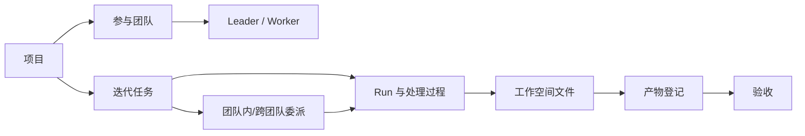

# 项目重规划与迭代路线图

> 状态：执行基线
> 更新日期：2026-09-13
> 适用范围：Hermes Agents Team 当前主分支

本文定义产品下一阶段的目标、优先级和验收口径。已经实现的能力以
[当前版本功能地图](FEATURE-MAP.md) 为准；具体使用方式以
[使用指南](USER-GUIDE.md) 为准；技术现状以 [架构说明](ARCHITECTURE.md) 为准。

## 1. 重新定位

Hermes Agents Team 的下一阶段定位是：**面向本地与可信内网的多团队 Agent 项目交付工作台**。

产品主线从“管理 Agent 和观察消息”调整为“围绕项目持续完成任务并验收产物”。
Agent、团队、对话、模型、Skill 和 MCP 都是项目交付所使用的资源；项目、任务、运行过程、
产物与验收结果构成业务主链路。

目标用户包括：

| 角色 | 主要诉求 | 产品应提供的结果 |
|---|---|---|
| 操作者 | 接入和维护 Agent | 明确的就绪状态、故障原因和恢复入口 |
| 项目负责人 | 组织多个团队交付 | 项目进度、任务依赖、风险和产物验收 |
| Team Leader | 拆解、派发、复盘 | 可控的派工、重试、移交和汇总流程 |
| Worker | 在明确范围内执行 | 完整上下文、独立任务范围和提交规范 |
| 验收者 | 判断结果是否可用 | 可预览的产物、验证证据、版本和审批记录 |

## 2. 当前功能盘点

当前代码已形成可用的本地协作基础。成熟度用于决定后续投入，不代表对外服务等级。

| 能力域 | 已有能力 | 成熟度 | 主要缺口 |
|---|---|---:|---|
| Agent 身份 | 接入/新建 Profile，保留 SOUL、Skill、记忆和配置 | 可用 | 缺少批量诊断和配置漂移检查 |
| Agent 运行时 | 初始化、启停、重启、就绪状态、交互终端 | 可用 | 故障分类、恢复建议和健康历史不足 |
| Agent 对话 | 新建会话、历史查看、上下文续聊、持久化 | 可用 | 非流式回复，真实模型回归覆盖不足 |
| 团队 | 多团队、Leader/Worker、成员调整、独立看板 | 可用 | 运行中迁移规则和数据库并发约束不足 |
| 项目 | 项目创建、团队多对多关联、统一目录 | 基础可用 | 无状态、负责人、里程碑、归档和删除策略 |
| 项目任务 | 从项目创建迭代任务，继承项目上下文 | 基础可用 | 无显式依赖图、优先级、取消与重试策略 |
| 协同编排 | 团队内拆解、跨团队 Leader 委派、人工输入 | 可用 | 缺少统一编排状态机、超时和移交 SLA |
| 过程追踪 | Runs、日志、Worker 过程和最终结果持久展示 | 可用 | 缺少事件关联 ID、过滤、检索和导出 |
| 工作空间 | 项目/任务范围、文件树、在线预览、下载、终端入口 | 基础可用 | 任务空间是逻辑视图；无版本、上传、锁和变更记录 |
| 产物 | 路径登记、负责人、摘要和验证说明 | 基础可用 | “已登记”与“已验收”未形成状态闭环 |
| 用量 | 从 Profile 日志聚合团队 Token 和调用次数 | 基础可用 | 非账本式存储，覆盖率和成本口径不可审计 |
| 配置资源 | 模型、MCP、Skill、SOUL 管理 | 可用 | 分散在 Agent 入口，缺少项目级资源基线 |
| 实时通信 | SSE、终端 WebSocket、局部轮询刷新 | 可用 | 多套刷新机制并存，连接状态和降级不可观测 |
| 数据与迁移 | SQLite、启动时建表和兼容列补齐、团队导入导出 | 可用 | 缺少正式 schema migration、项目整体备份恢复 |
| 安全 | 可选 API Bearer Token、敏感字段脱敏 | 实验 | WebSocket、MCP、整站与租户隔离未覆盖 |
| 测试 | 32 个 Python 测试文件、4 个浏览器回归脚本 | 良好基础 | 真实 Hermes、模型与跨团队端到端尚未自动化 |

## 3. 当前核心链路



目前 `P → T → R → F → AR` 已经存在，`AR → AC` 仍缺少独立的数据状态与操作记录。
因此近期最有价值的工作是补齐项目生命周期和产物验收，而不是继续增加新的资源管理页面。

## 4. 信息架构调整

Web UI 逐步收敛为以下一级入口：

| 一级入口 | 默认回答的问题 | 包含内容 |
|---|---|---|
| 工作台 | 现在最需要处理什么？ | 运行中、阻塞、待验收、异常连接、最近项目 |
| 项目 | 项目交付到哪里了？ | 概览、任务、产物、团队、工作空间、活动 |
| 执行中心 | 所有任务正在如何运行？ | 看板、依赖、Runs、人工介入、失败重试 |
| Agent 与团队 | 哪些资源可调度？ | 团队、成员、状态、负载、能力和用量 |
| 对话 | 与某个 Agent 的连续沟通 | 会话列表、历史和新建会话 |
| 资源配置 | Agent 使用什么能力？ | 模型、MCP、Skill、SOUL 和项目资源基线 |
| 系统 | 服务是否健康且可恢复？ | 连接、诊断、事件、备份、导入导出和安全 |

短期不做一次性大改版。先让“项目”成为默认业务入口，并把已有页面按上述层级建立跳转和上下文；
完成数据闭环后再拆分当前大型模板和脚本。

## 5. 领域模型目标

现有关系继续兼容，并补齐以下业务对象：

```text
Project ──< ProjectTeam >── Team ──< Agent ── Profile
   │
   ├──< Milestone ──< Task ──< Run ──< Event
   │                    │
   │                    ├──< Delegation / Assignment
   │                    └──< ArtifactSubmission ──< Acceptance
   │
   └── Workspace ──< FileRevision
```

实施规则：

- Project 是任务、团队、资料和交付物的归属单位。
- Task 只有一个当前状态，所有变更写入可追踪事件。
- Run 表示一次执行尝试；重试创建新 Run，不覆盖旧过程。
- ArtifactSubmission 表示一次提交；Acceptance 单独记录通过、驳回和意见。
- Workspace 首先继续复用本地目录，版本能力优先使用文件摘要与 Git 元数据，避免立即构建文件存储系统。
- 旧任务允许没有 project_id；新项目任务必须带 project_id，迁移采用渐进方式。

## 6. 设计原则

1. **项目优先**：新增交付能力必须能从项目进入，并能回到项目进度。
2. **单一事实来源**：任务状态、Run 结果、产物状态分别只有一个权威数据源。
3. **历史不可覆盖**：重试、重新提交和重新验收追加记录，旧过程仍可查看。
4. **状态可解释**：每个阻塞或失败状态包含原因、发生时间、责任对象和下一步动作。
5. **实时可降级**：事件推送失败时允许轮询恢复，并在 UI 显示连接状态和数据新鲜度。
6. **兼容现有 Profile**：不复制或删除用户的 Hermes 身份数据。
7. **先稳后扩**：先完成可靠性、交付与验收闭环，再考虑多租户和公网服务。

## 7. 发布阶段

### R1：稳定运行基线

目标：操作者能判断系统是否可工作，并能从失败中恢复。

- 统一 Agent、Kanban、MCP、SSE、WebSocket 的健康检查结果。
- 建立错误码和错误分类：配置、未就绪、连接、超时、权限、执行、数据。
- 任务运行引入关联 ID，页面可按任务、Run、Agent 过滤过程记录。
- 为终端 WebSocket 和 MCP 明确认证策略；补齐部署前检查。
- 引入正式数据库迁移机制和升级前备份检查。
- 建立真实 Hermes 冒烟测试清单，并保留最近验证环境与结果。

验收：常见故障能在一个页面看到原因和恢复动作；升级不依赖人工猜测数据库结构；历史过程不因刷新、重连或重试丢失。

### R2：项目交付闭环

目标：一个项目可以从创建持续推进到验收和归档。

- 项目增加负责人、状态、计划时间、里程碑和归档。
- 项目主页增加进度、阻塞、待验收和团队负载摘要。
- 任务增加优先级、截止时间、显式依赖、取消和重新执行。
- 产物增加提交版本、校验摘要、待验收/通过/驳回状态和验收意见。
- 项目活动流统一记录团队变更、任务状态、产物提交和验收。
- 提供项目级备份清单，覆盖数据库记录与项目目录。

验收：项目负责人可以仅在项目页判断当前进度、下一步、阻塞责任和交付是否通过。

### R3：协同治理

目标：多团队协作可以预测、控制和复盘。

- 统一团队内拆解与跨团队委派的状态机。
- 支持超时、重试上限、取消传播和人工接管。
- 提供 Agent 能力标签、并发容量和排队策略。
- 增加跨团队移交记录、响应时限和验收责任。
- 将任务依赖展示为列表与有向图，并检测循环依赖。
- 提供按项目、团队和 Agent 的成功率、耗时与阻塞分析。

验收：重试不会产生重复交付，取消能到达未完成子任务，跨团队结果有明确接收人与验收记录。

### R4：可运营与产品化

目标：部署方可以度量、备份和维护系统。

- 将 Token 使用记录为可追溯账本，标明数据来源和覆盖率。
- 提供数据保留、日志导出、备份验证和恢复演练。
- 拆分前端模块，统一请求、状态缓存、错误提示和实时连接层。
- 增加无障碍、键盘操作、移动端和主流浏览器验收矩阵。
- 若产品目标扩展到非可信网络，再设计用户、角色、租户、审计与密钥管理。

验收：用量数字可追溯到任务和 Run；备份经过恢复验证；前端不再由不同页面各自维护刷新与错误处理。

## 8. 优先级任务清单

| 编号 | 优先级 | 交付项 | 完成标准 | 前置 |
|---|---:|---|---|---|
| P0-01 | P0 | 系统健康与预检 | 页面展示各依赖状态、错误原因、检测时间和恢复建议 | 无 |
| P0-02 | P0 | 统一运行标识 | Task、Run、事件和终端日志可以关联检索 | P0-01 |
| P0-03 | P0 | 实时连接治理 | SSE/WS 显示连接状态，断线重连且不清空旧数据 | P0-02 |
| P0-04 | P0 | 数据库迁移 | schema 版本可查、迁移可重复执行、失败可回滚 | 无 |
| P0-05 | P0 | 真实环境冒烟 | 覆盖启动 Agent、模型回复、派工、产物登记与过程回看 | P0-01 |
| P1-01 | P1 | 项目生命周期 | 草稿、进行中、阻塞、待验收、已完成、已归档可追踪 | P0-04 |
| P1-02 | P1 | 里程碑与进度 | 项目可分阶段，进度由任务状态计算并可解释 | P1-01 |
| P1-03 | P1 | 任务依赖与控制 | 依赖校验、优先级、取消、重试均保留历史 | P0-02 |
| P1-04 | P1 | 产物提交与验收 | 每次提交有版本和摘要，可通过或驳回并记录意见 | P1-01 |
| P1-05 | P1 | 项目活动流 | 项目关键变更按时间统一展示并可过滤 | P0-02 |
| P1-06 | P1 | 项目备份恢复 | 可导出清单，恢复后项目、任务、产物路径一致 | P0-04 |
| P2-01 | P2 | 委派状态机 | 团队内外委派共享超时、取消、重试和完成语义 | P1-03 |
| P2-02 | P2 | 调度容量 | 能力标签、并发上限和队列规则参与派工 | P2-01 |
| P2-03 | P2 | 用量账本 | Token 与调用按项目/任务/Run/Agent 可追溯聚合 | P0-02 |
| P2-04 | P2 | 前端模块化 | 请求、缓存、实时连接和错误组件统一 | P0-03 |

推荐先完成 P0-01、P0-02、P0-03、P0-04，再并行推进 P0-05 与 P1-01。

当前分支进展：P0-01 已完成代码与自动化验证；当前 Windows 环境只读探测结果为数据库、事件流和终端正常，Hermes CLI、Kanban 不可用，MCP 因未启动完整 ASGI 服务显示降级。此结果说明降级路径生效，不代表部署环境验收通过。

### 8.1 首轮开发切片：系统健康与恢复入口

首轮只交付 P0-01，并为 P0-02、P0-03 预留字段，不同时改造全部页面。

**后端契约**

- 新增 `GET /api/system/health`，返回 `checked_at`、`overall_status` 和 `components`。
- 组件至少包括 database、hermes_cli、kanban、mcp、event_stream 和 terminal。
- 组件状态统一为 ready、degraded、unavailable；每项包含 message、latency_ms 和 recovery_action。
- 检查默认只读且有超时；不得因模型不可用阻塞整个请求。
- 响应中不返回 API Key、Header、命令行敏感参数或本机隐私路径。

**Web 交付**

- 工作台顶部显示整体状态和最近检测时间。
- degraded/unavailable 可展开查看原因，并直接跳转到对应配置或 Agent。
- 页面保留最后一次成功结果；刷新失败时显示“数据可能已过期”，不清空内容。
- 提供手动重新检测；自动检测使用单一调度器，页面切换不重复创建定时器。

**测试与完成条件**

- 覆盖全部正常、单组件降级、超时、敏感信息脱敏和数据库不可用。
- 浏览器回归覆盖加载、降级、请求失败、重新检测和窄屏展示。
- 部署文档增加启动前检查、故障解释和恢复步骤。
- 完成后在功能地图登记为已实现，并记录真实 Hermes 环境的人工验证结果。

## 9. 统一验收口径

每个功能项完成时必须同时满足：

- 数据：对象、字段、状态迁移和兼容策略已经定义。
- API：成功、空数据、非法输入、冲突、无权限和依赖故障有明确响应。
- UI：加载、空、错误、离线、只读和成功状态可识别，操作后上下文不丢失。
- 历史：刷新、重连、重启与重试后仍能查看先前记录。
- 测试：服务层或接口层覆盖核心规则；关键用户路径有浏览器回归。
- 运维：配置项、数据位置、升级方式、备份范围和安全边界有文档。
- 可观测：关键动作带项目、任务、Run 和 Agent 标识，可定位失败点。

项目“已完成”还需满足：所有必需任务完成、没有未解决阻塞、必需产物均已提交且验收通过、验收记录可回看。

## 10. 产品与工程指标

| 指标 | 定义 | 首阶段目标 |
|---|---|---:|
| 任务启动成功率 | 成功进入首个 Run 的任务 / 发起任务 | ≥ 95% |
| 过程记录完整率 | 能查看提示、Run、日志和结果的已运行任务占比 | 100% |
| 失败可解释率 | 带分类、原因和恢复建议的失败占比 | ≥ 90% |
| 阻塞响应时间 | 从进入阻塞到人工响应的中位时间 | 可统计并持续下降 |
| 产物验收覆盖率 | 有明确验收结论的必需产物占比 | 100% |
| 实时恢复时间 | 断线后恢复数据刷新的时间 | ≤ 10 秒 |
| 用量归属覆盖率 | 可归属到项目/任务/Run 的 Token 占比 | R4 达到 ≥ 95% |
| 回归稳定性 | 主分支自动化回归通过率 | 100% |

指标首先用于发现问题，不用于评价单个 Agent。

## 11. 明确边界

在 R1–R3 阶段维持以下边界：

- 面向本地和可信内网，单控制台写进程，SQLite 继续作为默认数据库。
- Agent 同一时刻最多属于一个团队；项目与团队保持多对多。
- 项目工作空间使用本地文件系统，任务工作空间继续是任务产物的逻辑范围。
- 不自行实现通用代码托管、在线 Office 编辑或对象存储。
- 不在缺少用户、租户和完整认证设计时宣称可安全暴露公网。
- 不把产物登记视为验收通过，不把 Agent 输出摘要视为验证证据。

当单机并发、数据量或部署范围突破这些边界时，再评估 PostgreSQL、任务队列、对象存储和租户权限。

## 12. 文档治理

| 文档 | 职责 | 更新时机 |
|---|---|---|
| `README.md` | 定位、快速开始和主要入口 | 对外入口变化时 |
| `FEATURE-MAP.md` | 当前代码已经实现的事实 | 每个功能合并时 |
| `PROJECT-ROADMAP.md` | 目标、优先级、阶段与验收 | 规划或优先级变化时 |
| `ARCHITECTURE.md` | 当前架构、数据流和技术边界 | 架构与数据模型变化时 |
| `USER-GUIDE.md` | 用户实际操作路径 | UI 或操作规则变化时 |
| 领域文档 | 项目、看板、对话、MCP 等细节 | 对应领域变化时 |
| 旧设计计划 | 历史决策参考 | 不再作为当前完成度依据 |

每次迭代按以下顺序维护：先更新代码和测试，再更新功能地图与领域文档；只有目标或优先级变化时更新本路线图。
